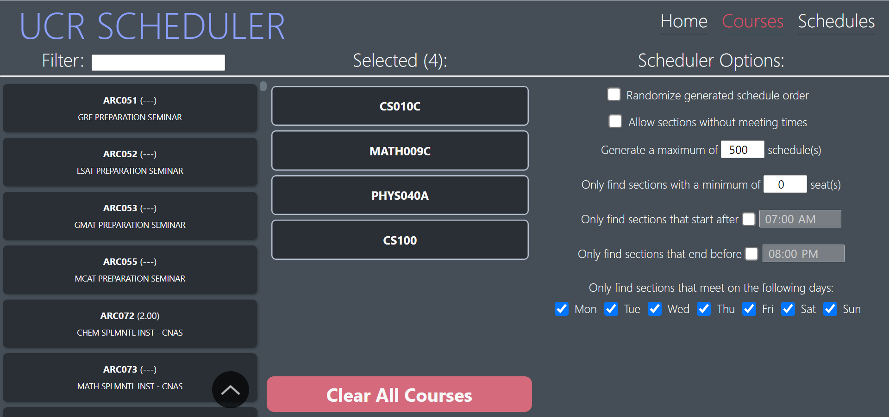
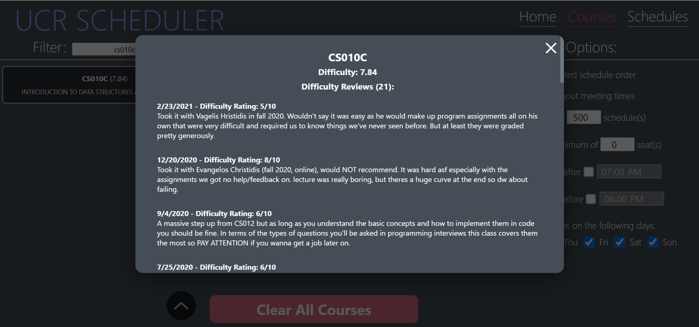
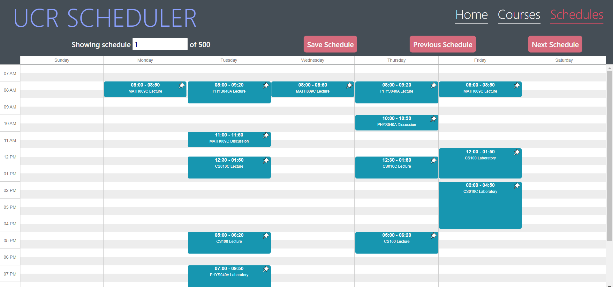

# UCR Schedule Generator

## About
### This tool allows students to easily view many potential class schedules so they can select the one that fits best for their needs. Time conflicts and linked sections are dealt with automatically saving students time and energy and preventing frustration.

## [Link to website](https://lwang.github.io/ucr-scheduler/)

## Self-hosting with Docker
### If you have Docker installed, you can use the Dockerfile in this repo to run the scheduler on your local machine
* Step 1: Download the [Dockerfile](https://raw.githubusercontent.com/lwang/ucr-scheduler/public/Dockerfile)
* Step 2: Build the image with `docker build -t ucr-scheduler .`
* Step 3: Run a container with `docker run --rm -it -p 3000:80 -p 8000:8000 scheduler:latest`
* Step 4: Visit the scheduler in your browser: [localhost:3000](http://localhost:3000/)

## Images

